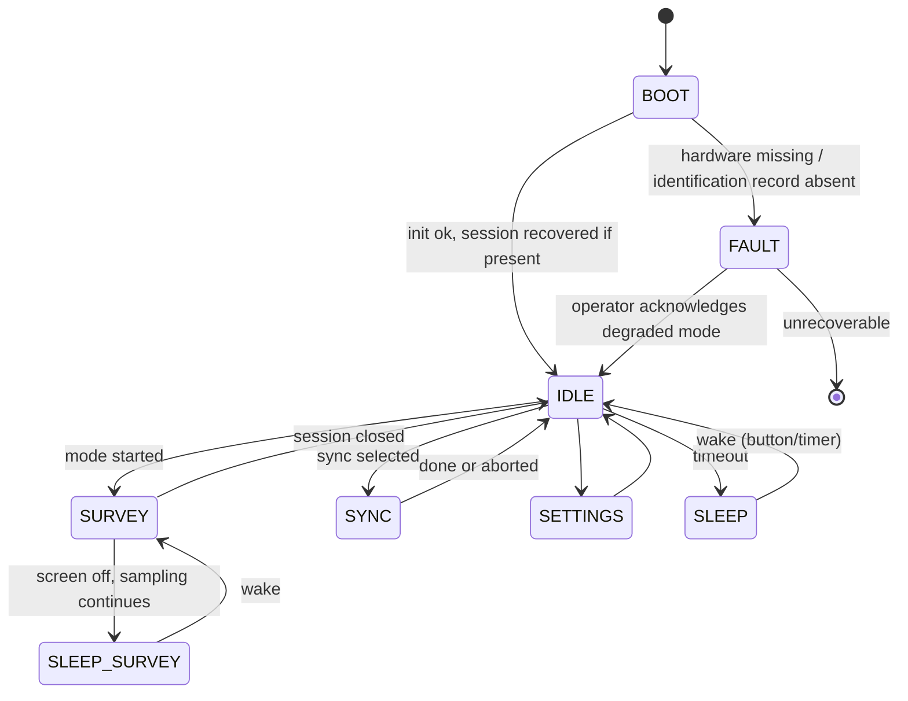
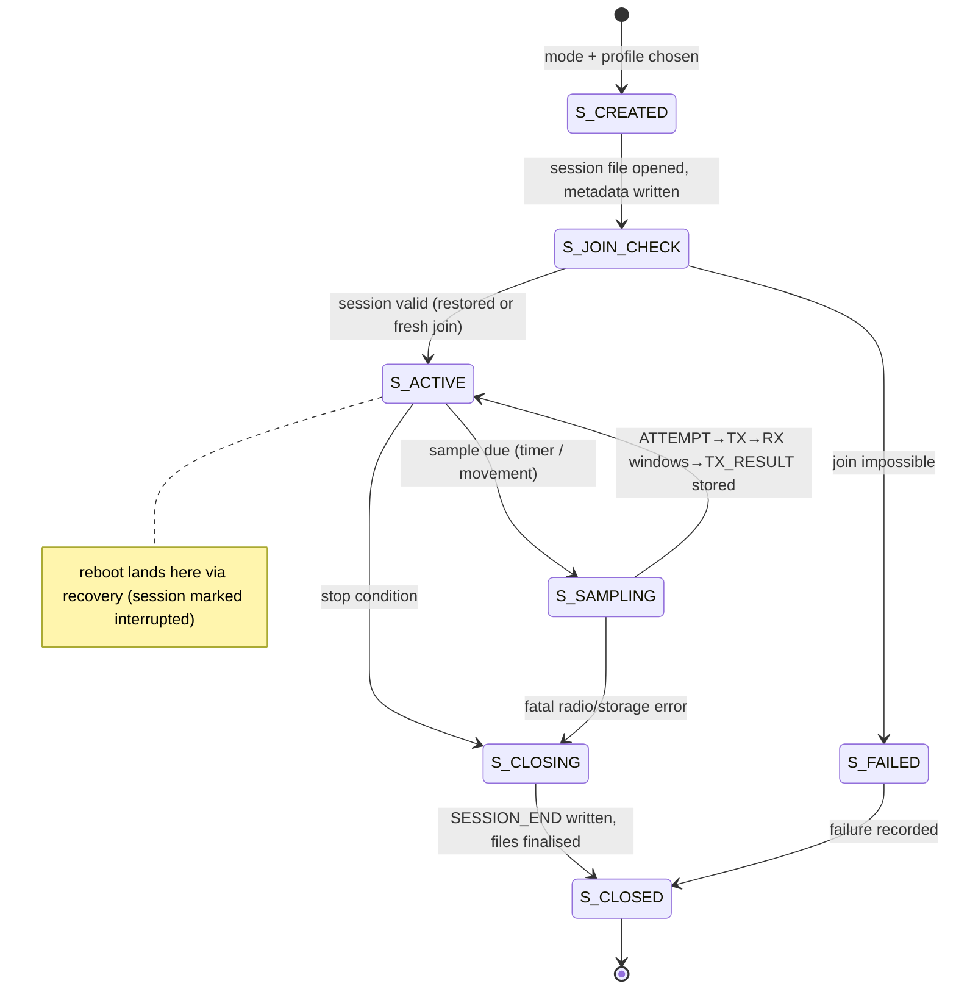
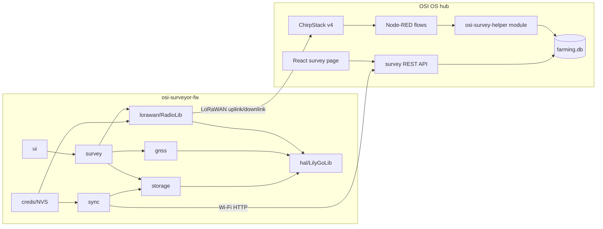
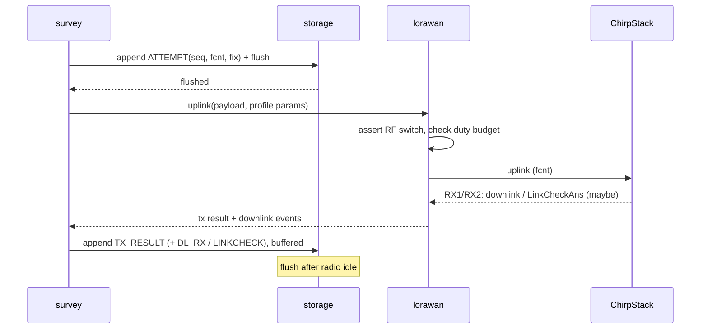
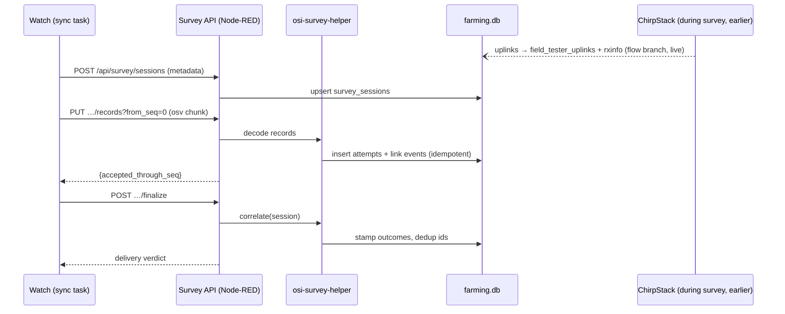

# OSI Surveyor: MVP design

Date: 2026-09-01. This is the implementation-ready design for release R1 of the
[roadmap](04-product-roadmap.md). It assumes the R0 gate passed: the unit is an
identified 868 MHz SX1262 SKU, the RF switch question is answered, join, LinkCheck,
persistence and duty-cycle behaviour are bench-proven, and the power model carries
measured numbers. Hardware claims referenced here are tagged and sourced in
[02-hardware-feasibility.md](02-hardware-feasibility.md). Everything in this document
describing hub endpoints, tables or flows that do not exist yet is a proposal; existing
surfaces are named with file references.

## 7.1 Product definition

**Name.** OSI Surveyor: firmware `osi-surveyor-fw` on the LILYGO T-Watch Ultra, plus a
survey backend and map page in OSI OS.

**Purpose in one sentence.** Answer "will an OSI device work at this exact spot, at this
height, with this radio configuration" with evidence an installer can act on in the
field and a researcher can reproduce later.

**Primary users.** OSI installers, super-users and technicians; researchers running
field trials; the OSI Academy as a teaching instrument. Not farmers.

**Primary jobs to be done.**

1. Before mounting hardware: test whether a planned position joins and delivers uplinks
   to the OSI network, at the target device's radio settings.
2. After a network change: walk a repeatable route and compare delivery against the
   previous survey.
3. During diagnosis: distinguish "uplinks fail", "uplinks work but downlinks fail" and
   "only one gateway hears this spot".
4. Afterwards: hand the hub a complete, honest record, including every attempt that
   died on air.

**Usage environments.** Open fields, orchards and crop canopy; ladders and masts;
trenches; bright sun, rain, gloves; farms with no internet and no cellular service;
EU868 in Switzerland for the MVP.

**Assumptions.** One hub per surveyed network, running OSI OS with ChirpStack v4 and
Node-RED; the watch is registered on that hub's ChirpStack by a technician before field
work; the operator is trained (Academy toolkit); GNSS is available outdoors with
accuracy recorded per fix rather than assumed.

**Constraints.** EU868 duty cycle (1% on the uplink sub-bands used) enforced in
firmware at all times; gateway half-duplex means downlinks are budgeted, not free;
Class A only; payloads must fit DR0 (51-byte application limit) so every mode works at
SF12; offline end to end; MIT-compatible dependency set (NFC stack excluded); the hub
remains the only authority for anything that touches irrigation.

**Functional requirements.**

- FR1: quick probe, stationary point test, walk survey and join test modes.
- FR2: every planned transmission written to local storage before the radio is keyed.
- FR3: target-device profiles controlling DR, power, payload size, interval and
  acknowledgement pattern.
- FR4: live per-sample feedback on the watch (margin, gateway count, downlink receipt)
  clearly separated from post-sync delivery statistics.
- FR5: Wi-Fi sync of sessions to the hub, resumable and idempotent; microSD export as
  fallback.
- FR6: hub-side correlation of attempts with ChirpStack receptions, stored per gateway.
- FR7: hub GUI map of samples, missing attempts, per-gateway signal, gateway count,
  uplink and downlink layers, session comparison; GeoJSON and CSV export.
- FR8: survives reboot mid-session without losing persisted records or LoRaWAN session
  state.

**Non-functional requirements.**

- NFR1: UI remains responsive (touch acknowledged within 200 ms) while receive windows
  are serviced; receive windows are never blocked by UI or storage.
- NFR2: a 4-hour point test and a 3-hour walk survey complete on one charge, per the
  power budget in section 7.14, validated by measurement.
- NFR3: storage writes are power-loss safe: a hard reset costs at most the record
  currently being appended.
- NFR4: all persistent formats (files, payloads, tables, exports) carry a version
  field.
- NFR5: no LoRaWAN key material in survey files, exports, logs, or sync traffic.

**Non-goals.** Commissioning, alerts, actuation, NFC, BLE, cloud sync, heatmap
interpolation, offline base-map tiles, farmer-facing anything, LoRaWAN 1.1, regions
other than EU868 (the region abstraction exists; only EU868 is validated).

**Dependencies.** R0 outcomes; Arduino-ESP32 pinned core; LilyGoLib (HAL only);
RadioLib 7.7.x; LVGL 9.x; hub-side: migration runner, flows.json wiring, React GUI,
Leaflet (BSD-2) for the map page.

**Success metrics.** An installer decides a mounting position with the watch alone
(no laptop, no second person at the dashboard); a repeated route survey reproduces
PDR per grid cell within the tolerance defined in 7.17; the RAK10701 comparison shows
agreement within the calibrated offset; zero silent data loss across the pilot.

**User stories.**

- An installer checks whether a planned sensor position can join the OSI LoRaWAN
  network: join test at the spot, then a 20-sample point test at the sensor's profile;
  verdict on the wrist in under ten minutes.
- A technician performs a stationary test at the planned position and height of a
  valve actuator: watch strapped to the mast at 60 cm, point test running unattended,
  collected 30 minutes later.
- A researcher walks a repeatable route and compares network performance before and
  after a gateway change: same route file, two sessions, grid-cell diff on the hub map.
- A super-user identifies locations where uplinks work but downlinks are unreliable:
  walk survey with downlink sampling; the map's downlink layer disagrees with its
  uplink layer exactly where the problem is.
- An installer exports a survey to the local OSI hub without internet access: hub
  Wi-Fi AP, sync screen, done; or the microSD card into any laptop that can reach the
  hub GUI.

## 7.2 What "network test" means

A LoRaWAN "test" can stop at any of a dozen layers, and results at one layer say
nothing about the next. The MVP names them and states which it measures.

| # | Layer | Evidence | MVP coverage |
|---|---|---|---|
| L0 | Radio transmission attempted | Local attempt record | Always |
| L1 | Frame received by no gateway | Attempt with no matching reception | Always (after sync) |
| L2 | Frame received by one gateway | One `rx_info` row | Always (after sync) |
| L3 | Frame received by several gateways | Multiple `rx_info` rows | Always (after sync) |
| L4 | OTAA join requested | Join-test record | Join test mode |
| L5 | Join accepted | JoinAccept received | Join test mode |
| L6 | Application uplink received by ChirpStack | Uplink event exists | Always (after sync) |
| L7 | Uplink processed by the OSI application | Survey decode row, `decode_ok` | Always (after sync) |
| L8 | Downlink queued | Hub queue record | Sampled |
| L9 | Downlink transmitted | Gateway accepts (ChirpStack `txack`) | Not in MVP; noted below |
| L10 | Downlink received by the watch | Watch downlink record | Sampled |
| L11 | Confirmed-message acknowledgement | LoRaWAN confirmed machinery | Deliberately excluded from bulk use |
| L12 | Link-check response | `LinkCheckAns` margin and gateway count | Regular, in every mode |
| L13 | Complete test passed | Composite of the above for one point | Displayed as separate results, never one number |

Layers L8–L10 are sampled because every downlink silences a half-duplex gateway for
its airtime and spends the shared RX2 sub-band budget. L9 (`txack`) is not consumed in
the MVP: the hub records what it queued (L8) and the watch records what arrived (L10),
which brackets the gateway's transmission; adding `txack` consumption is listed as a
backlog item because it localises failures between L8 and L10 but requires a new MQTT
subscription (`flows.json` currently subscribes to `event/up` only, per the repo
sweep). Layer L7 in the MVP means the survey backend decoded and stored the payload;
wider OSI application behaviour (irrigation logic) is out of scope by design.

**Method comparison and recommendation.**

| Method | What it measures | Verdict |
|---|---|---|
| Raw LoRa point-to-point ping | PHY only, against a second custom device, outside the LoRaWAN service | Rejected: needs extra hardware, bypasses everything the fleet depends on |
| LoRaWAN unconfirmed uplink | L0–L7 when correlated | Adopted as the bulk sample |
| LoRaWAN confirmed uplink | Adds L11, but retransmits on silence | Rejected for bulk (retransmissions corrupt PDR); available in the STREGA-like profile for realism, clearly marked |
| `LinkCheckReq`/`LinkCheckAns` | L12: margin and gateway count, live | Adopted for on-watch feedback; costs a MAC downlink, so scheduled, not per-sample |
| Application-layer acknowledgement | L8+L10 without confirmed-frame semantics | Adopted for downlink sampling: the existing field-tester response and the OSI ack (7.10) |
| Join testing | L4–L5 | Adopted as an operator-triggered mode; never automatic (DevNonce growth, airtime, session churn) |
| Network-server event correlation | L1–L3, L6–L7, authoritatively | Adopted as the authority for delivery statistics |

The combination: unconfirmed uplinks carry the survey; LinkCheck gives the operator a
live number the network vouched for; application acks sample the downlink direction on
a budget; correlation after sync produces the statistics; joins are tested when the
question is joining.

## 7.3 Attempt logging and correlation

The network server cannot report packets it never received, so the watch's local log
is the only source of truth for the denominator of every delivery statistic. This
section is the contract that makes that log usable.

**Write-ahead rule.** Before the radio is keyed, the firmware appends an `ATTEMPT`
record carrying the session UUID, the sequence number (`seq`, monotonically increasing
per session from 0), the LoRaWAN frame counter the stack will use (`fcnt`), the
current GNSS fix with validity and accuracy, the profile reference, and planned radio
parameters. Only after this record is on storage does transmission proceed. After the
transmit and receive windows close, a `TX_RESULT` record with the same `seq` is
appended carrying what actually happened: the radio result code, actual data rate,
frequency, time-on-air, and any downlink or `LinkCheckAns` received in the windows
(also logged as their own records). A crash between the two records leaves an attempt
whose result is unknown, which the format represents honestly (see 7.9).

**Correlation identity.** ChirpStack identifies an uplink by DevEUI and frame counter,
and its deduplicated uplink event carries both plus the full `rx_info` array
(02-hardware-feasibility, ChirpStack section). The watch payload additionally carries
`(session_short_id, seq)` (7.10). Correlation proceeds:

1. Primary match: `(dev_eui, fcnt)` from the attempt record against the stored uplink
   event, within the session's time bounds. This works even when payload decoding
   fails, because `fcnt` is in the LoRaWAN header.
2. Confirmation: the decoded payload's `(session_short_id, seq)` must agree with the
   attempt record. Disagreement flags the row rather than silently accepting it.
3. Rejoin boundaries: a new join resets `fcnt`; the session log records the join event
   and the new DevAddr, so matching is performed per join epoch. `seq` never resets
   within a session, which is why it exists in the payload at all.

**Outcome classification after correlation.**

| Outcome | Rule |
|---|---|
| Delivered | Attempt matched to exactly one deduplicated uplink event |
| Delivered, radio-proven | No matching event, but the attempt's own RX windows carried a `LinkCheckAns` or its echoed-seq ACK: the network demonstrably received it, so the loss is hub-side ingestion (L6), not radio (L1) |
| Missing | Attempt with `TX_RESULT` success, no matching event, and no watch-side network evidence |
| Not transmitted | Attempt whose `TX_RESULT` reports a radio or duty-cycle error, or is absent (crash) ; excluded from the PDR denominator, counted separately |
| Duplicate reception | ChirpStack deduplicates per uplink; a second event with the same `(dev_eui, fcnt, dedup_id)` is impossible, but re-synced watch records are deduplicated by `(session_uuid, seq)` unique keys |
| Multi-gateway | One event, N `rx_info` rows stored individually (existing `field_tester_rxinfo` shape) |
| Received but not processed | Uplink event stored with `decode_ok = 0` (existing column) |
| Downlink queued but not received | Hub `survey_link_events` row of kind `DL_QUEUED` with no watch record of kind `DL_RX` for that `seq` |
| Interrupted session | Session file lacks a `SESSION_END` record; the hub marks the session `end_reason = 'interrupted'` and statistics carry that flag |

**Clock discipline.** Correlation never depends on the watch's wall clock. `fcnt` and
`seq` are the identities; timestamps are context. The watch RTC is set at pairing and
opportunistically via `DeviceTimeAns`; each sync reports the watch's clock offset as
observed by the hub, stored in session metadata so exports can state time uncertainty.

## 7.4 Survey modes

Four modes ship. Gateway overlap is an analysis layer, not a mode (03-review, A.1
verdicts); target emulation is a parameter set (7.5), not a mode.

| Property | Quick probe | Point test | Walk survey | Join test |
|---|---|---|---|---|
| Question answered | "Is the network here at all?" | "How good is this exact spot and height?" | "Where does delivery degrade along this route?" | "Can a device join from here?" |
| Start conditions | Joined session exists | Joined; GNSS fix or explicit "no-fix, position pinned on hub map later" | Joined; GNSS fix with accuracy ≤ 20 m | Operator-triggered; requires stored credentials |
| GNSS | One fix attempt, proceeds without | Fix required at start, re-checked each sample; watch stationary | Continuous tracking | One fix attempt |
| Transmission strategy | 3 uplinks, LinkCheck on each | N samples at fixed interval | Sample on movement (25 m) or timeout (30 s), whichever first | Deactivate, OTAA join, reactivate previous session on completion |
| Duration / count | ~1 minute | Default 30 samples (configurable 10–120) | Until stopped, battery floor, or storage floor | Up to 3 join attempts |
| ADR | Off (fixed DR per profile), `LinkADRReq` honoured but profile DR re-asserted per sample | Same | Same | n/a |
| Data rate | Profile DR (default DR3/SF9) | Profile DR | Profile DR | Join DR per LoRaWAN regional defaults |
| TX power | Profile power (default +14 dBm EIRP ceiling for EU868) | Profile | Profile | Stack default |
| Payload | OSI survey uplink, 20 bytes (7.10) | Same | Same | Join frames only |
| Confirmed | Never | Profile may request confirmed on the last sample only, marked | Never | n/a |
| Downlink sampling | LinkCheck ×3 | LinkCheck every 5th sample; app ack requested on samples 1, N/2, N | LinkCheck every 10th sample; app ack every 20th | JoinAccept itself is the downlink |
| Duty-cycle safeguard | `setDutyCycle(true)` always; every mode asks `timeUntilUplink()` and waits; the wait is displayed | Same | Same; cadence floor = max(30 s, regulatory wait) | Join attempts spaced ≥ 30 s |
| Live feedback | Margin, gateway count, "reply/no reply" per uplink (an absent LinkCheckAns proves only that no round trip completed, never that the uplink went unheard) | Running tally, last margin, gateway count, downlink receipts | Trace of last 20 samples, current margin, sample counter | Join result and duration per attempt |
| Stored results | Session with 3 attempts + link events | Session with N attempts + link events | Session, attempts, link events, GNSS track | Session with join events |
| Stop conditions | Completes by itself | Sample count reached, or operator stop | Operator stop, battery < 15%, storage full | Attempts exhausted or success |
| Failure behaviour | Reports per layer (7.16) | Aborted test keeps its partial session | Interruption keeps everything up to the last flushed record | Failure restores the previous session state |

Notes. The point test's stationarity matters: the watch warns if GNSS reports movement
above walking noise mid-test, because a moved point test is a different measurement.
The walk survey's movement trigger uses GNSS distance, not the IMU, to avoid a
dependency on uncalibrated step detection. The join test deliberately consumes a
DevNonce and says so on screen; it restores the persisted session afterwards so route
surveys are not forced into a rejoin. At DR0 the
regulatory floor dominates the cadence (≈1 sample per 2–3 minutes on the 1%
bands), so a walking pace yields one sample per 100+ metres: mode start
discloses the achievable cadence for the selected profile, and DR0 walk
sessions are labelled sparse-by-construction end to end. The displayed
airtime wait is RadioLib's own `timeUntilUplink()` answer floored by the
rolling-hour model, never less — the screen must not say "ready" while the
stack refuses. Continuous confirmed uplinks appear in no mode;
the assessment demanded by the brief is in 7.2 (gateway half-duplex, RX2 budget,
retransmission bias) and the design consequence is the sampling schedule above.

## 7.5 Target-device profiles

A survey at the watch's favourite settings answers a question nobody asked. Profiles
pin each session to a realistic radio configuration.

**Format.** Versioned JSON documents, authored and stored on the hub, synced to the
watch at pairing and on demand; the watch caches the active set. `profile_id` is a
small integer carried in every uplink and attempt record; `(profile_id,
profile_version)` is recorded in session metadata, so a re-versioned profile never
silently changes the meaning of old sessions.

```json
{
  "schema": "osi.survey.profile/1",
  "profile_id": 3,
  "version": 2,
  "name": "LSN50 soil node, worst case",
  "example_device": "DRAGINO_LSN50",
  "region": "EU868",
  "dr": 0,
  "tx_power_dbm": 14,
  "payload_len": 20,
  "uplink_interval_s": 60,
  "confirmed": false,
  "join_method": "OTAA",
  "install_height_cm": 20,
  "antenna_note": "internal whip, enclosure at soil level",
  "mobility": "stationary",
  "downlink_expectation": "rare",
  "notes": "DR0 mirrors a node stuck at SF12 after ADR backoff"
}
```

The MVP ships five built-ins: `watch-default` (DR3, the survey workhorse),
`lsn50-worst-case` (DR0), `kiwi-typical` (DR2), `strega-valve` (DR3, confirmed last
sample, `downlink_expectation: "required"` so the mode forces downlink sampling up to
every 5th sample), and `dr-sweep` (point test only: cycles DR5→DR0 across the sample
count to characterise a spot across the whole rate range). `payload_len` pads the OSI
payload with zeros to the target length so time-on-air matches the emulated device.
Profile sync validates the field: values below 20 are rejected (the OSI sample cannot
shrink), and the padded length must fit within the profile DR's maximum FRMPayload,
so a profile can never cause a mid-session stack refusal.

**Limits of emulation, stated for the record.** A profile reproduces data rate, power,
payload length, cadence and acknowledgement pattern. It reproduces nothing physical:
the watch's antenna is an uncharacterised element on a test point
(02-hardware-feasibility, GNSS/RF sections), worn on a body or strapped to a mast,
while an LSN50 hangs in an enclosure and a buried array sits under wet soil. Every
screen, export and map that shows profile-based results labels them "watch as
<profile>", and the calibration task in
[06-implementation-backlog-and-tests.md](06-implementation-backlog-and-tests.md)
measures the watch-to-reference offset per profile rather than assuming it away. The
stationary point test exists precisely so the position-and-height half of realism is
physical, not simulated.

## 7.6 Coverage and quality metrics

**Raw measurements** (stored as recorded, never modified): attempt count and per-attempt
radio parameters; per-gateway RSSI, SNR, channel and CRC status from `rx_info`;
`LinkCheckAns` margin and gateway count; downlink receptions with their RSSI/SNR as
read on the watch; join durations; GNSS fix, accuracy, satellite count per sample;
battery percentage per sample; frequency, DR, TX power actually used.

**Derived metrics** (computed at read time from raw rows, formula stated in code and
export metadata):

| Metric | Formula | Stratification |
|---|---|---|
| Packet delivery ratio (PDR) | delivered ÷ (delivered + missing); "not transmitted" excluded and reported beside it | Per session, per grid cell, per DR, per profile |
| Join success rate | joins accepted ÷ joins attempted | Per session |
| Join duration | JoinAccept time − JoinRequest time, per attempt | Distribution, not mean only |
| Downlink success rate | `DL_RX` count ÷ `DL_QUEUED` count | Per session; shown with its own (small) sample count |
| Round trip | app-ack receive time − uplink time, watch-side | Sampled |
| Gateway count | `rx_info` rows per delivered uplink | Per sample; distribution per cell |
| Sample density | samples per grid cell | Map layer and confidence input |

No composite "coverage quality score" is computed. The temptation is real and the
brief forbids it correctly: a single number hides exactly the uplink/downlink and
margin/delivery distinctions the tool exists to expose.

**Classification.** The map and the watch use a four-level classification, applied to
uplink and downlink results separately, never merged:

| Level | Uplink rule (per grid cell or point test) | Downlink rule |
|---|---|---|
| Good | PDR ≥ 0.95 and median margin ≥ 10 dB, n ≥ 10 | DL success ≥ 0.9, n ≥ 5 |
| Marginal | PDR ≥ 0.8 or median margin 3–10 dB, n ≥ 10 | DL success ≥ 0.5, n ≥ 5 |
| Poor | PDR < 0.8, some delivery, n ≥ 10 | DL success < 0.5, n ≥ 5 |
| No service | Zero delivery with n ≥ 5 transmitted attempts | No receptions with n ≥ 3 requests |
| Insufficient data | Below the n threshold: shown grey, never classified | Same |

These thresholds are declared provisional in the UI and export metadata until the
calibration procedure has run: surveys at fixed positions bracketing known-good and
known-dead locations around an OSI gateway, thresholds adjusted so the classification
agrees with observed device behaviour at those positions, and re-checked per profile
(a DR0 profile tolerates lower margins than DR5 by construction; the margin thresholds
shift with DR and the calibration records the shift). Limitations stated wherever the
classification appears: it describes the watch's radio at the recorded position and
profile, sample counts bound its confidence, and it does not transfer to another
device's antenna without the measured offset from the reference-device comparison.

## 7.7 Mapping design

**Division of labour.** The watch renders the current result, a 20-sample trace and
counters; it never renders a map. OSI OS renders the map, stores raw points and
derived aggregates, filters, compares and exports. This split follows both analyses
(01, A.1) and the hardware reality: a 410×502 wrist display in sunlight is for
glancing, and the hub GUI already has the navigation, auth and i18n scaffolding.

| Concern | Decision |
|---|---|
| Coordinate system | WGS84 (EPSG:4326), coordinates stored as signed 1e-7 degree integers end to end (matching ChirpStack's location convention); display projection is the map library's default Web Mercator |
| Timestamps | UTC ISO 8601 in tables and exports; watch clock offset per session in metadata; ordering authority is `(session, seq)`, never wall time |
| GNSS accuracy | Stored per point; map dims points with accuracy > 15 m and excludes them from grid aggregates by default (toggleable); no-fix samples appear in a "position unknown" list, not on the map |
| Raw points | Circles coloured by the selected metric; missing attempts are distinct hollow markers at the last valid fix, so failure is visible geometry, not absence |
| Route | Polyline through samples in `seq` order, drawn under the points |
| Grid aggregation | Square cells about 50 m per side, computed as `floor(lat / 0.00045)` and `floor(lon / (0.00045 / cos(lat)))`; cell size is a stored parameter of the aggregate, not a constant baked into data |
| Interpolation | None. Cells with data are painted; cells without stay empty. A smooth surface would assert measurements nobody made |
| Missing packets | Present in every layer: raw (hollow markers), grid (they lower the cell PDR), exports (rows with `outcome = missing`) |
| Multi-gateway | Per-gateway layer (colour per gateway, filterable via `field_tester_rxinfo.gateway_id`) and a gateway-count layer per cell |
| Uplink vs downlink | Separate layers, separate legends, separate sample counts; never one combined colour |
| Session comparison | Two sessions selected; the grid layer shows ΔPDR per cell where both have n ≥ threshold, grey elsewhere |
| Reproducibility metadata | Session carries firmware version, unit id, hardware identification record reference, profile id+version, region parameters, RF-switch state assertions, gateway list active during the session, grid parameters, threshold set version |
| Offline base map | None in MVP: blank neutral background, scale bar, north indicator, gateway markers (positions from ChirpStack), zone outlines where `latitude`/`longitude` exist. When the browser has internet, an optional OSM raster layer can be enabled; the page never requires it. Offline tile packs are an R4 roadmap item |
| Deferred | Tile packs, heatmap/interpolated surfaces, cross-hub aggregation, cloud mirroring, elevation profiles |

Rendering: Leaflet (BSD-2) with `L.CRS.Simple`-style blank background plus optional
OSM `L.TileLayer`; points and grid as GeoJSON layers served by the survey API (7.11).
The GUI has no map dependency today (repo sweep finding), so this is new, deliberately
small surface: one page, one library, no plugins in the MVP.

## 7.8 Firmware architecture

### Framework choice

| Option | For | Against |
|---|---|---|
| Arduino framework + LilyGoLib | The only vendor-supported path for this board; RadioLib is Arduino-first; LILYGO's LoRaWAN persistence example runs on this exact watch; MIT throughout | Pinned to an alpha Arduino-ESP32 core; Arduino IDE ergonomics; LilyGoLib is young |
| Native ESP-IDF | First-class FreeRTOS, partitioning, OTA and flash-encryption tooling | No board support: LILYGO documents no IDF path for this device; every driver (PMU, expander, display, touch, haptics) would be ported by OSI; RadioLib's IDF usage is secondary |
| Hybrid (Arduino as IDF component) | IDF tooling with Arduino libraries | Both toolchains' failure modes at once, on an alpha core; unjustified for an MVP |

**Recommendation: Arduino framework, built with `arduino-cli` for reproducibility, on
the pinned core LILYGO requires, with LilyGoLib used strictly as a hardware
abstraction (init, PMU, display bring-up, SPI mutex) and never as an application
framework.** PlatformIO is explicitly not used: its LilyGoLib fork is nine months
stale, pinned to an incompatible core, and unlicensed (02-hardware-feasibility,
"Software framework"). The trade accepted: worse IDE ergonomics and an alpha-core
maintenance burden, in exchange for the only configuration the vendor tests, an
MIT-clean dependency tree, and R0 bench results that transfer directly to R1 code.
Deviations from LilyGoLib defaults are mandatory and centralised in `hal/`:
`setTCXO(3.0)`, `setDio2AsRfSwitch()`, explicit RF-switch assertion before every
transmit, and `setDutyCycle(true)` (all four justified in 02-hardware-feasibility).

### LoRaWAN stack

| Criterion | RadioLib 7.7.x | MCCI LMIC | basicmac | LoRa Basics Modem |
|---|---|---|---|---|
| T-Watch/SX1262 support | Yes, vendor example on this board | SX1276-class; SX126x effectively absent | SX126x yes; board no | SX126x yes; board no |
| Regional parameters | RP002 1.0.4, EU868 among them | Older RP | EU868 yes | Current |
| Spec support | TS001 1.0.4 and 1.1 | 1.0.2/1.0.3 era | 1.0.3 era | Current |
| OTAA + session/nonce persistence | First-class buffer API, demonstrated in NVS+RTC RAM on this watch | Manual, fragile | Manual | Yes, heavy integration |
| MAC commands / LinkCheck | `sendMacCommandReq` + `getMacLinkCheckAns(margin, gwCnt)` | Limited | Partial | Yes |
| Downlink callbacks | Event struct per downlink with RSSI/SNR readable | Yes | Yes | Yes |
| Licence | MIT | EPL/MIT mix | Revised BSD | Licence not verified (02, unresolved Q15) |
| Maintenance | Active, commits within two weeks of research date | Low | Unverified | Semtech-paced |
| Memory / integration | Proven on this exact board | n/a | Unknown port cost | ESP-IDF-scale port |

**Recommendation: RadioLib.** It is the only candidate satisfying board support,
LinkCheck access, persistence, licence and maintenance at once; the runner-up cost of
every alternative is a port that R0 would have to validate from scratch. Pinned
explicitly in the project, not inherited from LilyGoLib's stale `library.json` pin.

### Modules and repository structure

New repository `osi-surveyor-fw` (proposal; keeps the OpenWrt firmware repo's CI and
size gates out of the embedded build):

```
osi-surveyor-fw/
├── src/
│   ├── main.cpp              # boot, task creation, app state machine
│   ├── hal/                  # LilyGoLib wrapper; the ONLY file including LilyGoLib
│   ├── power/                # power states, battery, sleep entry/exit
│   ├── ui/                   # LVGL screens, navigation, haptic vocabulary
│   ├── gnss/                 # UART NMEA/UBX, fix state, power modes
│   ├── lorawan/              # RadioLib wrapper, session persistence, duty budget
│   ├── survey/               # session manager, modes, sampling scheduler
│   ├── storage/              # record format, session files, recovery
│   ├── sync/                 # Wi-Fi client, chunked upload, resume
│   ├── config/               # profiles cache, settings, region guard
│   ├── creds/                # NVS access for keys/tokens; no other module touches NVS secrets
│   └── diag/                 # ring-buffer log, fault records
├── include/osi_survey/       # public headers: events.h, records.h, result.h
├── test/                     # host-side unit tests (record codec, correlation ids, duty budget)
├── tools/                    # hw-probe sketch, record-file dump/verify tool
└── docs/
```

**Dependency rule:** `ui` and `sync` depend on `survey`; `survey` depends on
`lorawan`, `gnss`, `storage`, `config`; everything may depend on `hal`, `diag`,
`include/`; nothing depends on `ui`. `creds` is reachable only from `lorawan` (keys)
and `sync` (token). Enforced by review and a header-include lint in CI.

**State ownership.** `survey/SessionManager` owns the active session and is the only
writer of session state; `lorawan` owns LoRaWAN session/nonce state and its NVS
persistence; `storage` owns file handles; `ui` owns nothing but widget state and reads
a snapshot struct published by `survey` over a FreeRTOS queue.

**Events.** A single `osi_event_t` (enum + small payload union) on a FreeRTOS queue
per consumer: `EVT_GNSS_FIX`, `EVT_SAMPLE_DUE`, `EVT_TX_DONE`, `EVT_RX_DOWNLINK`,
`EVT_LINKCHECK_ANS`, `EVT_STORAGE_FLUSHED`, `EVT_BATTERY_LOW`, `EVT_SYNC_PROGRESS`,
`EVT_FAULT`. Producers never block on a full queue; overflow increments a counter and
raises `EVT_FAULT` (a survey tool must observe its own losses).

**Error propagation.** Every fallible call returns a typed `osi_result_t`; errors are
logged to `diag`, mapped to user-visible states in `ui`, and never silently retried
more than a bounded, stated number of times. Radio errors mark the attempt's
`TX_RESULT` record; storage errors escalate to the session state machine (7.16).

### Concurrency

FreeRTOS tasks, descending priority:

| Task | Priority | Role |
|---|---|---|
| `radio` | highest app | Owns the SX1262 from TX start until RX2 close or downlink completion; services DIO1; hands results to `survey` by queue |
| `gnss` | high | Drains the UART, parses, publishes fixes; never touches SPI |
| `survey` | mid | Scheduler and state machines; composes records; enqueues storage writes |
| `storage` | mid-low | Appends records from a PSRAM ring buffer to FATFS; forbidden to run its flush while `radio` holds the bus/critical window |
| `ui` | low | LVGL tick and rendering; reads snapshots |
| `sync` | low, only in SYNC state | Wi-Fi + HTTP upload |

The rule that keeps receive windows honest: between uplink start and RX2 close, the
shared SPI bus belongs to `radio` (LilyGoLib's `lockSPI()` held), and `storage`
buffers to PSRAM instead of flushing. The attempt record is flushed to FATFS *before*
TX begins (write-ahead), so the deferred writes are only `TX_RESULT` and later
records. Wi-Fi is never active during a running survey session (power and interrupt
latency, 02-hardware-feasibility "Can everything run in one firmware"); the SYNC
state is entered only from the home screen with no session open. Display DMA stays at
LilyGoLib's default; if R0 profiling shows render stalls threatening RX windows, the
renderer drops frames, never the radio.

### State machines









## 7.9 Local data storage

### Format comparison

| Option | Append-before-TX latency | Power-loss recovery | Size | Verdict |
|---|---|---|---|---|
| Fixed binary records + CRC | One 64 B write + sync, bounded | Scan valid-CRC prefix, truncate tail | Smallest | **Chosen** |
| CBOR sequence | Small, variable | Needs framing to resync after torn write | Small | Rejected: variable-length framing buys nothing here; every field is known and fixed |
| JSON Lines | Large writes | Line-based recovery is easy | 5–10× | Rejected as the primary store; produced at export/debug time by the dump tool instead |
| SQLite on watch | Transaction cost per record; WAL on FAT over SPI flash | Journal recovery, but corruption on hard power loss over FATFS is a real failure class | Largest | Rejected: wrong tool under a 64 B/record append workload and abrupt power loss |
| Hybrid log + index | As binary | As binary | Index adds state to corrupt | Rejected for MVP: sessions are small enough to scan; an index is an optimisation with no present need |

**Storage medium.** Primary store is the internal 9.9 MB FATFS partition (wear-levelled
by the ESP-IDF layer underneath Arduino's `FFat`), not the microSD card. Reasons: the
SD card may be absent (a designed-for case, 7.16), internal flash does not sit on the
shared radio SPI bus, and capacity is not the constraint (arithmetic below). The SD
card is an export and backup medium: a closed session can be copied to SD on demand or
at session close when a card is present.

### Record format

Every file is a sequence of fixed 64-byte records, little-endian. Record 0 is the
header; every subsequent record is `type(1) flags(1) seq(2) payload(56) crc32(4)`,
where CRC-32 (IEEE) covers bytes 0–59. Fixed size makes torn-write recovery a scan and
unknown-type skip trivial.

Header record: magic `OSVY` (4), format version u8 (=1), record size u8 (=64),
session UUID (16), watch DevEUI (8), profile id u8, profile version u8, region u8
(enum, 1=EU868), firmware version u8×3, boot counter u16, mode u8, session start
unix time u32, session short id u16, reserved to byte 59, CRC-32.

| Type | Name | Payload (within 56 bytes, unused = zero) |
|---|---|---|
| 0x01 | `ATTEMPT` | fcnt u32, unix time u32, uptime ms u32, lat i32 (1e-7°), lon i32, alt i16 (m), accuracy u16 (dm, 0xFFFF unknown), sats u8, fix flags u8, DR u8, TX power dBm i8, payload len u8, battery % u8 |
| 0x02 | `TX_RESULT` | result code i16 (RadioLib code), actual DR u8, frequency Hz u32, time-on-air ms u16, duty-cycle wait ms u32 (a DR0 refusal waits minutes; u16 would wrap), fcnt after u32 |
| 0x03 | `DL_RX` | triggering seq's fport u8, RSSI dBm i16, SNR ×4 i8, length u8, first 44 payload bytes |
| 0x04 | `LINKCHECK` | margin dB u8, gateway count u8, Ans RSSI i16, Ans SNR ×4 i8 |
| 0x05 | `JOIN_EVT` | kind u8 (1 req, 2 accept, 3 fail), attempt u8, duration ms u32, DR u8, DevAddr u8×4, epoch starting fcnt u32 (the correlation tiebreaker of §7.3) |
| 0x06 | `MARKER` | kind u8 (1 operator mark, 2 battery, 3 fault, 4 recovery), detail u8×16 |
| 0x07 | `SESSION_END` | reason u8 (1 completed, 2 operator stop, 3 battery, 4 storage, 5 fatal error), totals: attempts u16, tx ok u16, downlinks u16, linkchecks u16 |

`seq` in the record frame is the sample sequence for `ATTEMPT`/`TX_RESULT` and the
associated sample for `DL_RX`/`LINKCHECK`; `0xFFFF` for records not tied to a sample.

Example `ATTEMPT`, annotated (values: seq 7, fcnt 42, Zurich test point 47.3769°N
8.5417°E, alt 408 m, accuracy 3.2 m, 9 sats, DR3, +14 dBm, 20-byte payload, 87%):

```
01 01 0700  2A000000 68B7D468 10270000  28243D1C  285C1705
9801 2000 09 07 03 0E 14 57  00…00  <crc32>
```

**File layout and naming.** `/survey/<YYYYMMDD>-<session_short_hex>.osv` plus a
sidecar `<same>.json` holding the human-readable session metadata (profile snapshot,
operator label, hub id). The sidecar is written twice, via temp-file-and-rename:
once at session open (marked `"open": true`) and once at close. The `.osv` file is
append-only with `fsync` after the header and after every pre-transmit `ATTEMPT`
flush; buffered records (`TX_RESULT` and later) are flushed when the radio goes idle
and at least every 10 s.

**Recovery.** At boot, any sidecar marked open triggers recovery: scan the `.osv`
validating CRCs, truncate at the first invalid record, append a `MARKER(recovery)`
and either resume the session (operator choice, new join epoch recorded) or close it
with `SESSION_END(reason=fatal)` and `end_reason` mapped to `interrupted` at the hub.
A file whose header record fails CRC is quarantined (renamed `.osv.bad`) for the
hub-side salvage tool (`tools/` dump utility reads both).

**Capacity.** A walk-survey sample averages ~2.3 records (ATTEMPT + TX_RESULT plus
sampled DL/LINKCHECK) ≈ 147 B. At the 30 s cadence floor: ~18 KB/hour; the 9.9 MB
partition holds hundreds of survey hours, and the several-hours requirement is met
with three orders of magnitude of headroom. Retention on the watch: sessions are
deleted only after the hub confirms `finalize` (7.11) or by explicit operator action.

**Secrets.** Session files and exports carry the DevEUI (an identifier) and never key
material. AppKey, session keys, nonces and the sync token live in NVS under `creds/`
(7.15); the storage module has no read path into NVS.

## 7.10 LoRaWAN payload and application protocol

**Port map.** FPort 10: OSI survey uplink and its downlink ack (this protocol).
FPort 1/11: disk91 field-tester compatibility mode, unchanged, decoded by the
existing backend (`@rakwireless/field-tester-server`, parser `cs34`) — compat mode is
a watch feature for zero-hub-change operation against any current OSI hub, and the
new backend also correlates those uplinks when present.

**Do coordinates belong in every uplink?** Options considered:

| Option | Verdict |
|---|---|
| Full coordinates every uplink | **Chosen.** 8 bytes buys: a live hub-side view during the survey, and survival of the survey's geometry if the watch is lost, drowned or never syncs. Correlation itself does not need them |
| Delta encoding | Rejected: deltas break at exactly the wrong moment (missing packets), and the saved bytes are not needed at DR0 (20 ≤ 51) |
| Sequence-only, coordinates synced later | Rejected: no live map, and a lost watch loses the whole survey's geometry |
| Periodic anchor + offsets | Rejected: complexity of both above, size benefit not needed |

Privacy consequence: uplink coordinates are the operator's position, broadcast in a
payload readable by the network operator (OSI's own hub). Handled in 7.15 (retention,
export scrubbing); not by weakening the protocol.

**Uplink `SAMPLE` (FPort 10, 20 bytes, little-endian):**

| Bytes | Field | Encoding |
|---|---|---|
| 0 | version/type | high nibble = protocol version (1); low nibble = type (0x1 SAMPLE) |
| 1–2 | session short id | u16, low 16 bits of session UUID's first 4 bytes |
| 3–4 | seq | u16 |
| 5 | flags | bit0 GNSS valid; bit1 GNSS stale (>10 s old); bit2 battery low; bit3 downlink requested (app ack solicited); bit4 payload padded to profile length; bits 5–7 reserved 0 |
| 6–9 | latitude | i32, degrees × 1e-7 (ChirpStack `common.Location` convention) |
| 10–13 | longitude | i32, degrees × 1e-7 |
| 14–15 | altitude | i16, metres, −32768 = unknown |
| 16 | accuracy | u8, units of 0.5 m, 255 = unknown |
| 17 | satellites | u8 |
| 18 | battery | u8, percent, 255 = unknown |
| 19 | profile id | u8 |

When the active profile's `payload_len` exceeds 20, the payload is zero-padded to
that length (flag bit4 set) so time-on-air matches the emulated device. Fields
deliberately absent because ChirpStack already reports them per uplink: DR,
frequency, fcnt, timestamps, and everything in `rx_info`. `session`+`seq` stay in the
payload despite `fcnt` existing, because they survive rejoins and let a decoder flag
mismatches (7.3).

**Downlink `ACK` (FPort 10, 8 bytes):** byte 0 version/type (0x1 ACK); 1–2 echoed
seq u16; 3 gateway count u8; 4 best RSSI (dBm + 200) u8; 5 best SNR ×4 i8; 6 server
flags (bit0 session known, bit1 attempts pending correlation high, bit2 retention
warning); 7 reserved. Sent only when flag bit3 requested it, keeping the downlink
budget under the mode schedule of 7.4.

**Worked example.** Sample seq 7, session short 0xBEEF, GNSS valid, downlink
requested, 47.3769°N 8.5417°E, 408 m, 3.0 m accuracy, 9 sats, 87%, profile 3:

```
11 EFBE 0700 09 28243D1C 285C1705 9801 06 09 57 03
```

Decoded: `0x11` → v1 SAMPLE; session 0xBEEF; seq 7; flags 0x09 (GNSS valid +
downlink requested); lat 0x1C3D2428 = 473 769 000 → 47.3769000°; lon 0x05175C28 =
85 417 000 → 8.5417000°; alt 0x0198 = 408 m; accuracy 6 × 0.5 = 3.0 m; 9 sats; 87%;
profile 3. A matching `ACK`: `11 0700 02 78 14 01 00` → seq 7, 2 gateways, best
RSSI −80 dBm, best SNR +5.0 dB, session known.

## 7.11 OSI hub integration

### Backend shape

| Option | Verdict |
|---|---|
| Node-RED flows only | Rejected: correlation and decoding logic buried in flow JSON is untestable and violates the data-model independence constraint |
| Small dedicated service (new daemon) | Rejected for MVP: a new always-on process, init script, log rotation and failure mode on a constrained Pi, duplicating plumbing Node-RED already provides |
| Existing OSI server components | Not applicable: survey data is edge-local; the cloud has no role in R1 |
| **Hybrid: Node-RED wires a versioned plain-JS module** | **Chosen.** Precedent is exactly this pattern: `osi-chirpstack-helper` and the field-tester tab. Flows do transport (MQTT in, HTTP in/out, SQLite node); `osi-survey-helper` owns decode, validation, correlation and SQL text; the schema is owned by the migration runner, not by flows |

### Ingestion and events

Consumed: the existing portable topic `application/+/device/+/event/up` (the flows
contract enforces this single topic, `validatePortableFlows()` in
`scripts/chirpstack-bootstrap.js`). A new flow branch filters uplinks whose
`deviceInfo.deviceProfileId` matches `CHIRPSTACK_PROFILE_SURVEYOR` (new, provisioned
by `chirpstack-bootstrap.js` alongside the existing profiles, LoRaWAN 1.0.4,
RP002 1.0.4, no codec) or the existing field-tester profile. All such uplinks are
written to the existing `field_tester_uplinks` + `field_tester_rxinfo` tables (which
already store payload, radio metadata and per-gateway RSSI/SNR); FPort 10 payloads
are additionally decoded by the module and stamped into two new nullable columns.
`ACK` downlinks are enqueued through the ChirpStack REST API on localhost:8080 using
the bootstrap-provisioned API key, recorded as `DL_QUEUED` link events (proposal; the
compat path's downlinks remain the field-tester node's job). No new MQTT topics in
the MVP; `event/txack` consumption is a backlog item (7.2).

Example uplink event (abbreviated to relevant fields):

```json
{
  "deduplicationId": "9e5c…",
  "deviceInfo": {"devEui": "70b3d5…", "deviceProfileId": "<SURVEYOR>"},
  "fCnt": 42, "fPort": 10, "dr": 3, "data": "Ee++BwAJqD89HEDIFgWYAQYJVwM=",
  "rxInfo": [
    {"gatewayId": "0016c001f11766e7", "rssi": -80, "snr": 5.0, "channel": 2},
    {"gatewayId": "0016c001f11715e2", "rssi": -112, "snr": -9.5, "channel": 2}
  ],
  "txInfo": {"frequency": 868300000}
}
```

### Schema (proposal: migration `0026__survey_backend.sql`)

Local-only tables, no sync triggers, following the `gateway_health_samples` and
`field_tester_*` precedent. The migration is `additive` class; it must be mirrored
into `database/seed-blank.sql`, added to `CHECKSUMS.json`, and pass the standing
verifier set (`verify-migrations`, `verify-seed-replay`,
`verify-runtime-schema-parity`, `verify-db-schema-consistency`,
`verify-no-stray-ddl`); the `osi-schema-change-control` skill governs execution.

```sql
CREATE TABLE survey_sessions (
  session_uuid   TEXT PRIMARY KEY,
  session_short  INTEGER NOT NULL,
  watch_dev_eui  TEXT NOT NULL,
  unit_label     TEXT,
  mode           TEXT NOT NULL CHECK (mode IN ('probe','point','walk','join')),
  profile_id     INTEGER NOT NULL,
  profile_version INTEGER NOT NULL,
  region         TEXT NOT NULL,
  fw_version     TEXT NOT NULL,
  started_at     TEXT NOT NULL,
  ended_at       TEXT,
  end_reason     TEXT CHECK (end_reason IN
                   ('completed','operator','battery','storage','fatal','interrupted')),
  clock_offset_ms INTEGER,
  synced_at      TEXT,
  meta_json      TEXT NOT NULL DEFAULT '{}'
);
CREATE INDEX ix_ss_watch ON survey_sessions(watch_dev_eui, started_at);

CREATE TABLE survey_attempts (
  session_uuid  TEXT NOT NULL REFERENCES survey_sessions(session_uuid),
  seq           INTEGER NOT NULL,
  fcnt          INTEGER,
  attempted_at  TEXT,
  lat_e7        INTEGER, lon_e7 INTEGER, alt_m INTEGER, acc_dm INTEGER, sats INTEGER,
  dr            INTEGER, tx_power_dbm INTEGER, toa_ms INTEGER,
  tx_result     INTEGER,
  flags         INTEGER NOT NULL DEFAULT 0,
  batt_pct      INTEGER,
  uplink_dedup_id TEXT,
  outcome       TEXT NOT NULL DEFAULT 'pending' CHECK (outcome IN
                  ('pending','delivered','missing','not_transmitted')),
  PRIMARY KEY (session_uuid, seq)
);
CREATE INDEX ix_sa_outcome ON survey_attempts(session_uuid, outcome);
CREATE INDEX ix_sa_dedup   ON survey_attempts(uplink_dedup_id);

CREATE TABLE survey_link_events (
  id           INTEGER PRIMARY KEY AUTOINCREMENT,
  session_uuid TEXT NOT NULL REFERENCES survey_sessions(session_uuid),
  seq          INTEGER,
  kind         TEXT NOT NULL CHECK (kind IN
                 ('LINKCHECK','DL_QUEUED','DL_RX','JOIN_REQ','JOIN_ACCEPT',
                  'JOIN_FAIL','MARKER')),
  at           TEXT,
  margin_db    INTEGER, gw_cnt INTEGER, rssi_dbm INTEGER, snr_db REAL,
  detail_json  TEXT NOT NULL DEFAULT '{}'
);
CREATE INDEX ix_sle_session ON survey_link_events(session_uuid, kind);
CREATE UNIQUE INDEX uq_sle_dedupe
  ON survey_link_events(session_uuid, kind, seq, at);

ALTER TABLE field_tester_uplinks ADD COLUMN survey_session_uuid TEXT;
ALTER TABLE field_tester_uplinks ADD COLUMN survey_seq INTEGER;
CREATE INDEX ix_fte_survey ON field_tester_uplinks(survey_session_uuid, survey_seq);
```

**Correlation** runs in `osi-survey-helper` when a session is finalized and again on
demand: for each `pending` attempt with a successful `tx_result`, find the
`field_tester_uplinks` row for the session's watch DevEUI whose `f_cnt` matches
within the session's join epochs and time bounds; stamp `uplink_dedup_id`, set
`outcome`, and cross-check decoded `(session_short, seq)` when FPort 10 decoding
succeeded. Pure function of the tables: idempotent, re-runnable after any restart.

### API (proposal; all endpoints bearer-authenticated via the existing `verifyBearer` pattern)

Unlike the legacy unauthenticated `GET /download-fieldtest` (flagged by the repo
sweep), every survey endpoint requires a token: operator tokens from the normal GUI
login, watch tokens from pairing with role `survey` (scoped: sessions and profiles
only).

| Endpoint | Purpose |
|---|---|
| `POST /api/survey/pair` | Body `{pairing_code}` (6 digits, generated in the GUI, 10-minute TTL, single use) → `{token, hub_id, api_version, min_fw_protocol}` |
| `GET /api/survey/profiles` | Active profile set for the watch cache |
| `POST /api/survey/sessions` | Session metadata; idempotent by `session_uuid` |
| `PUT /api/survey/sessions/:uuid/records?from_seq=N` | Body: raw `.osv` records (binary, content-type `application/octet-stream`); response `{accepted_through_seq}`; idempotent, resumable |
| `POST /api/survey/sessions/:uuid/finalize` | `{end_reason, totals}`; triggers correlation; response includes `{delivered, missing, not_transmitted}` so the watch can display the verdict |
| `GET /api/survey/sessions`, `GET …/:uuid/summary` | Listing and correlated summary for GUI |
| `GET …/:uuid/export.geojson`, `GET …/:uuid/export.csv` | Exports (7.7 metadata embedded) |
| `GET /api/survey/map/points`, `GET /api/survey/map/grid` | Filterable GeoJSON for the map page (`session`, `gateway`, `profile`, `dr`, `layer=uplink|downlink`, `cell_m`) |
| `DELETE /api/survey/sessions/:uuid` | Operator deletion; also the retention hook |

Example finalize response:

```json
{"session_uuid":"…","attempts":124,"delivered":117,"missing":5,
 "not_transmitted":2,"downlinks":{"queued":7,"received":6},
 "linkchecks":12,"outcome_version":1}
```

**Retention and recovery.** `OSI_SURVEY_RETENTION_DAYS` (default 365) pruned by the
existing daily maintenance pattern; sessions are immutable after finalize except
deletion. Hub restart loses nothing: SQLite is durable, uploads are idempotent,
correlation is re-runnable. Everything works with no internet; nothing in this
section touches osi-server.

### Sequence



### Separation of work

- **Watch firmware:** everything in 7.8–7.10, 7.12–7.14.
- **ChirpStack configuration:** `CHIRPSTACK_PROFILE_SURVEYOR` device profile
  (1.0.4 / RP002 1.0.4, no codec) added to `chirpstack-bootstrap.js` with env
  override and UCI mapping, per its existing pattern; watch devices registered under
  the existing field-tester application.
- **OSI survey backend:** migration 0026; `osi-survey-helper` module; one new flow
  tab (uplink branch, API router, downlink enqueue, retention tick).
- **OSI OS dashboard:** survey page (map, sessions, compare, exports), feature flag
  `surveyUxEnabled` via `/api/system/features`, pairing-code dialog in settings,
  `survey.json` i18n namespace across the 7 locales.

## 7.12 Wi-Fi, Bluetooth, USB and SD synchronisation

| Option | Assessment |
|---|---|
| Watch joins the hub's Wi-Fi AP | **Primary.** The hub already runs an AP (`OSI-OS-<mac>`, WPA2, 192.168.0.1/24) when at Wi-Fi factory defaults; the GUI and API are at `:1880`. One fixed URL, no discovery problem |
| Watch joins the site LAN | **Primary variant.** Where the hub is on Ethernet/LAN, pairing stores the hub's base URL; there is no mDNS on the hub (repo sweep), so the URL from pairing is the discovery mechanism |
| BLE via a phone | Deferred: requires a phone app that does not exist; adds a third device to a two-device problem |
| USB serial | Kept for provisioning and debugging (7.15), not for routine sync |
| MicroSD removal | **Fallback.** Closed sessions copied to SD; any browser that reaches the hub GUI uploads `.osv` files through an import dialog that feeds the same records endpoint |
| Manual file import | Same dialog; also the salvage path for `.osv.bad` files |

Recommendation: Wi-Fi primary (AP or LAN URL), SD-plus-GUI-upload fallback. The sync
workflow and its failure handling:

- **No internet:** irrelevant by construction; all endpoints are hub-local.
- **Hub temporarily unavailable:** sessions persist on the watch; sync retries on
  operator demand; nothing auto-deletes before a confirmed finalize.
- **Interrupted transfer:** `from_seq` resume against `accepted_through_seq`; records
  idempotent on `(session_uuid, seq)`.
- **Duplicate transfer:** same idempotency; re-uploading a finalized session is a
  no-op returning the stored verdict.
- **Partial session:** only closed sessions upload; a session closed as `interrupted`
  uploads normally and is labelled as such end to end.
- **Firmware/backend version mismatch:** pairing returns `api_version` and
  `min_fw_protocol`; the watch refuses sync outside its supported range and shows
  which side is older; record format version travels in the file header and the
  backend rejects unknown majors with a distinct error the watch renders.
- **Clock mismatch:** hub records its own receive time and the watch-reported clock;
  offset stored in the session; identities are `(session, seq)`/`fcnt`, so statistics
  are immune (7.3).
- **Several hubs:** pairing is per hub; a session is bound at creation to the hub id
  whose network it surveys; the watch holds one token per paired hub and offers
  upload only to the owning hub.
- **Several watches:** sessions are keyed by UUID and carry the watch DevEUI; the
  backend accepts any paired watch's sessions independently.

## 7.13 User interface and field ergonomics

Design rules first, screens second: dark background with high-contrast content (AMOLED
power and sunlight legibility both favour it); one primary number per screen, readable
at a glance from a bent arm; touch targets as large as the layout allows (≈5 mm rows at this ~315 ppi panel — a fast path, never the guaranteed one); button navigation is the guaranteed path: BOOT cycles the focused row, the side button activates it; every action that must work in rain
or gloves is also on a physical button (power button short-press = context action,
GPIO0 button = back/stop-hold), because capacitive touch with wet or gloved fingers is
unreliable and the board offers exactly two readable buttons; no gesture-only
interactions; accidental-touch guard on destructive actions (hold 2 s with progress
ring). Firmware strings come from a single string table; the MVP ships English with
the table structured for the GUI's seven locales to follow. Uplink and downlink
results are never merged into one indicator anywhere. Three further display
rules from the 2026-09-03 expert review: the big margin number carries its
age ("2 samples ago") and greys out once stale, because a LinkCheck answer
arrives only every Nth sample; battery appears exactly once per screen (the
header); and refused transmissions are always shown with their count in warn
colour, never folded into the success line. Vocabulary is fixed per concept:
"reply / no reply" (round trip), "DL x/y received", "airtime wait", and
colour is never the sole carrier of a distinction (refused = hollow
full-height trace mark; a 10 dB hairline backs the trace).

Screens (`ui/` module, one LVGL screen each):

```
HOME                          STATUS                        WALK SURVEY (running)
┌──────────────────────┐      ┌──────────────────────┐      ┌──────────────────────┐
│ OSI Surveyor    87%▮ │      │ RADIO  SX1262 868MHz │      │ ▲12dB  GW:2   #047   │
│ Hub: kaba100  EU868  │      │  switch: BUILT-IN ✓  │      │                      │
│                      │      │ SESSION joined       │      │  UP ███████████░ 45/47│
│  ► Quick probe       │      │  fcnt 1042  DR3      │      │  DL ██░ 2/3 sampled  │
│  ► Point test        │      │ GNSS 9 sats  3.2m    │      │                      │
│  ► Walk survey       │      │ DUTY budget 64% free │      │  GNSS 3.1m  batt 82% │
│  ► Join test         │      │ STORAGE 96% free     │      │  ·····▪▪▪▫▪▪  trace  │
│  ► Sync    ► Settings│      │ CLOCK set (hub)      │      │  [hold ◉ to stop]    │
└──────────────────────┘      └──────────────────────┘      └──────────────────────┘

POINT TEST (running)          SESSION SUMMARY               SYNC
┌──────────────────────┐      ┌──────────────────────┐      ┌──────────────────────┐
│ sample 18/30   #B2F1 │      │ point  #B2F1  ✓done  │      │ Wi-Fi: OSI-OS-66E7 ✓ │
│                      │      │ UP  sent 30          │      │ hub kaba100          │
│   margin  11 dB      │      │     heard*  n/a→sync │      │ 3 sessions to send   │
│   gateways  2        │      │ LC  margin med 11dB  │      │ ▸ B2F1 sending 62%   │
│   DL 2/2 received    │      │ DL  2/2              │      │ ▸ 9A03 waiting       │
│                      │      │ *delivery = after    │      │ ▸ 5D11 verdict:      │
│ profile: lsn50-worst │      │  sync to hub         │      │   117/124 delivered  │
│ [hold ◉ to abort]    │      │ [sync now] [home]    │      │ [abort]              │
└──────────────────────┘      └──────────────────────┘      └──────────────────────┘
```

Remaining screens: **profile selection** (list with name, DR, power, height note;
active profile banner-confirmed on survey start), **quick probe** (three big rows:
heard/margin/gateways per uplink), **error and recovery** (plain-language fault, what
is still safe to do, "continue degraded" vs "stop"; recovery screen after reboot
offers resume/close of the interrupted session), **settings and region confirmation**
(region is read-only text from the hardware identification record and pairing; the
watch refuses to survey if profile region ≠ unit region — there is no region toggle
by design), plus the pairing dialog (enter 6-digit code shown in the hub GUI).

GNSS-fix waiting is a state, not a blocker: modes that need a fix show sat count and
accuracy converging, with "start anyway" only where 7.4 allows. Screen sleeps to a
black clock after 20 s (configurable); sampling continues with the screen off; any
button or wrist-raise (IMU) wakes it. Battery conservation is the default posture:
the walk survey is designed to run screen-off.

**Haptic vocabulary** (DRV2605 waveforms, deliberately minimal): one short pulse =
sample stored locally; two short pulses = downlink or LinkCheckAns received; one long
pulse = session stopped or fault needing a glance. Nothing else. A haptic never
signals delivery of an uplink (unknowable at buzz time) and never signals anything an
actuator did; both rules are restated in the operator guide.

## 7.14 Power design

Baseline figures and their provenance are in 02-hardware-feasibility ("Current draw
reference"): board deep-sleep floor ~840 µA and the open 600 µA display-rail anomaly
are LILYGO measurements; SX1262, ESP32-S3, MIA-M10Q and peripheral numbers are
datasheet values; none are yet measurements of this firmware on this unit. R0
replaces them; the model below sizes the design and sets the measurement plan.

**Firmware power states:**

| State | What is on | Modelled draw | Basis |
|---|---|---|---|
| SURVEY, screen on | ESP active, GNSS tracking, radio idle/burst, display | 60–120 mA | Datasheet sum; AMOLED content-dependent, dark UI assumed |
| SURVEY, screen off (walk) | ESP awake for GNSS parse (modem sleep between), GNSS tracking, radio bursts | 35–50 mA | 33 mA ESP WAITI + 12.9 mA GNSS + TX/RX duty share |
| POINT, screen off, between samples | ESP light sleep, GNSS power-save cyclic, RTC timer wake | 8–15 mA | 240 µA ESP + PSRAM + 7.6 mA GNSS cyclic + wake overhead |
| IDLE (home, screen on) | ESP active, GNSS off, radio standby | 40–90 mA | Display-dominated |
| SYNC | ESP + Wi-Fi, radio off, GNSS off | 100–340 mA peaks | Espressif figures |
| SLEEP | Deep sleep, RTC RAM held | ~0.9–1.1 mA | LILYGO board measurement |

**Consequences designed in:** screen timeout 20 s; the walk survey runs screen-off by
default; GNSS is duty-cycled per mode (continuous tracking only while walking;
power-save cyclic during point tests; off in IDLE/SYNC; hot-start budget preserved by
the always-on backup domain, a board property); Wi-Fi never runs during a survey;
TX uses the +14 dBm-optimal PA configuration if R0 confirms RadioLib selects it
(open question 5 in 02, worth 45 vs 90 mA on the dominant burst).

**Battery behaviour:** at 15% the watch refuses new sessions and warns; at 8% it
closes the running session cleanly (flush, `SESSION_END(battery)`, sidecar close); at
5% it syncs state to NVS and powers off. Every sleep entry is preceded by LoRaWAN
session persistence (nonces in NVS, session in NVS + RTC RAM) and a storage flush;
this is also the reboot-safety path.

**Targets (requirements, to be validated by measurement, not asserted):** a 4-hour
point test ends above 50% battery; a 3-hour walk survey ends above 40%. The model
supports both with margin (worst modelled walk draw 50 mA × 3 h = 150 mAh of
1100 mAh), and the margin is the point: the model contains an unexplained 600 µA
vendor anomaly, an uncharacterised display load and an unverified PA configuration,
so the targets are set where only a gross model error breaks them.

**Measurement plan (R0/R1):** per-state current on a USB-C/inline power profiler for
each row of the table above; one full simulated survey hour per mode with the log
replayed to attribute charge per phase; fuel-gauge drift check against the profiler
over a discharge; repeat of the walk figure with screen forced on as the pessimistic
bound. Results land in 02-hardware-feasibility as a measured column beside the model.

## 7.15 Security and provisioning

**Threat model, stated plainly:** the watch operates on farm-local networks against a
hub whose GUI already runs plain HTTP on the LAN; adversaries considered are a lost
or stolen watch, a curious LAN client, and accidental credential leakage through
files, exports, logs or git. Nation-state radio adversaries are out of scope, as they
are for the rest of the OSI edge.

- **LoRaWAN provisioning (OTAA).** Per-unit DevEUI derived from the ESP32-S3's
  factory MAC (EUI-64 expansion, globally unique by Espressif's OUI); per-unit random
  AppKey generated by the hub GUI at registration, pushed to ChirpStack, and
  delivered to the watch over USB serial in a provisioning mode (no camera exists for
  QR; manual 32-hex entry on a watch is an error factory). The provisioning tool
  prints nothing to shell history and the key never transits Wi-Fi.
- **Key storage.** AppKey, RadioLib nonce and session blobs, and the sync token live
  in NVS under a dedicated namespace accessed only by `creds/`. ESP32-S3 flash
  encryption + secure boot are a stated hardening backlog item, not in the MVP;
  until then the mitigation is custody (trained users, revocation) and per-unit keys
  so one lost watch compromises one identity. This limitation is documented, not
  hidden.
- **Dev/prod separation.** Bench hubs and farm hubs are different ChirpStack tenants
  with different keys; debug builds display a DEV banner, log verbosely with key
  redaction enforced at the logging call site, and refuse pairing codes from
  non-bench hubs (hub id allowlist compiled into debug builds only).
- **Git hygiene.** No keys, tokens or pairing codes in the firmware repo, test
  fixtures included; provisioning reads from an operator-local file outside the
  repo; CI secret-scans the tree (same policy as the OSI repos).
- **Device identity to the hub.** The DevEUI is the watch's identity; pairing binds
  it to an operator account and issues a `survey`-scoped bearer token (existing
  HMAC-signed token format, longer expiry, plus a hub-side revocation table checked
  on survey endpoints; the stateless-token pattern alone cannot revoke, so the table
  is part of the design).
- **Local API authentication.** Every survey endpoint authenticated (7.11); the
  legacy unauthenticated field-tester CSV route is not extended and gets an issue to
  gate or retire it.
- **NFC.** Not compiled into the MVP (licence and scope, 03-review); the standing
  rule for any future use: tags carry identifiers only, never keys or privileged
  credentials.
- **Survey privacy.** Coordinates are the operator's track. Defaults: survey data
  stays on the hub, retention 365 days, operator-visible deletion; exports offer a
  grid-aggregate-only mode for sharing beyond the farm; the operator guide states
  what is recorded and why (consent, Swiss FADP posture). GNSS retention on the
  watch ends when the hub confirms finalize.
- **Firmware signing and OTA.** MVP updates are USB-only, versions recorded per
  session. OTA, when it comes (R2+), requires signed images verified on-device; the
  policy is committed to now so no unsigned-OTA interim ever ships.
- **Factory reset.** Settings menu, hold-to-confirm: wipes NVS (keys, token,
  calibration) and survey storage, then reboots to provisioning mode; hub-side, the
  operator unclaims the device (ChirpStack delete + revocation row).
- **Lost watch.** Runbook: revoke the sync token (table), disable the ChirpStack
  device (its per-unit AppKey dies with it), mark the unit id retired; survey data
  already synced is unaffected; the watch holds no farm secrets beyond its own
  identity.
- **Actuation.** The MVP contains no actuation path of any kind. The standing rule
  for later releases is restated here because the brief demands it: a watch requests,
  the hub decides, and hub permissions, interlocks, runtime caps and audit logging
  are never bypassed.

## 7.16 Failure handling

| Condition | Behaviour |
|---|---|
| No GNSS fix | Probe/join proceed and mark samples position-unknown; point test offers "pin position on hub map later"; walk survey refuses to start (its geometry is its purpose) |
| Poor GNSS accuracy | Recorded per sample; map dims/filters (7.7); walk survey warns above 20 m but continues recording honestly |
| LoRaWAN join failure | Join test reports per-attempt; other modes require an existing session and direct the operator to the join test; after 3 failures the status screen shows last join error and duty wait |
| Region mismatch | Profile region ≠ unit identification region → survey refuses to start; pairing region ≠ unit region → pairing warns and blocks survey modes (settings still reachable) |
| Radio hardware not detected | Boot lands in FAULT with the probe result on screen; no survey modes offered; identification record requirement (02) enforced here |
| No gateway reception | Honest zeros: live screen shows "not heard" per LinkCheck/ack absence; after sync the session shows `missing` outcomes; classified No service at n ≥ 5 |
| Uplink works, no downlink | Uplink and downlink indicators diverge by design; downlink layer shows its own failure; watch never infers downlink health from uplink success |
| ChirpStack unavailable (hub down mid-survey) | Indistinguishable from no coverage on air; the survey records honestly; at sync, the hub's ingest gap is visible as `missing` with a hub-side note if ChirpStack downtime is known; nothing on the watch pretends to know |
| OSI application (survey backend) unavailable | Uplinks still land in ChirpStack→`field_tester_uplinks` if flows run; if Node-RED is down entirely, sync fails cleanly and retries later; records wait on the watch |
| Hub Wi-Fi unavailable | Sync screen reports which network it sought; SD export path offered; sessions keep |
| Watch reboots during a session | Recovery flow (7.9): scan, truncate, resume-or-close; LoRaWAN session restored from NVS/RTC RAM; frame counters continue (never reset silently); session marked with a recovery marker and epoch |
| MicroSD absent | Normal operation; internal FATFS is primary (7.9); SD-dependent actions greyed out |
| MicroSD full / internal storage low | At 90%: warning; at 98%: running session closes with `SESSION_END(storage)`; new sessions refused until space is freed or synced |
| Corrupt log file | CRC scan quarantines `.osv.bad`; salvage tool on the hub recovers valid prefix records; the session appears with a corruption flag rather than vanishing |
| Battery critically low | 15/8/5% ladder (7.14); the 8% close guarantees `SESSION_END` and sidecar finalisation before the 5% shutdown |
| Incorrect clock | Detected at pairing/sync (offset beyond threshold reported); correlation is clock-independent (7.3); exports carry the offset so timestamps are interpretable |
| Duplicate session ID | UUIDs make collision negligible; the backend treats a metadata re-POST as idempotent and a records conflict (same `(uuid, seq)`, different bytes) as an integrity error flagged for the salvage tool, never silently overwritten |
| Profile changed during survey | Impossible in UI: profile is fixed at session start; changing profile = closing the session and starting a new one (the session is the unit of comparability) |
| Firmware/backend protocol mismatch | Refuse-and-explain at pairing and sync (7.12); on-air payloads carry the version nibble so the backend stores-but-flags unknown minors and rejects unknown majors |

## 7.17 Acceptance criteria

Pass/fail, no vague terms. "Verified" means a written record with the command or
procedure and its output.

1. The unit's hardware identification record exists (SKU, module marking or probe
   result, switch/antenna census, band confirmation) and firmware refuses survey
   modes without one.
2. The watch joins the test OSI ChirpStack (EU868, 1.0.4/RP002 1.0.4 profile) via
   OTAA: 10 consecutive joins succeed from a known-good bench position.
3. Write-ahead holds: with storage instrumented, every transmitted frame's `ATTEMPT`
   record precedes its TX in the log timeline, over a 100-sample session, 0
   exceptions.
4. Reboot safety: power is cut mid-walk-survey 10 times at random points; every
   restart recovers the session file with at most the in-flight record lost, the
   session closes as `interrupted`, and it syncs and correlates.
5. Frame counters and nonces survive: across 20 reboot cycles including 5 full
   power-offs, `fcnt` never regresses and no unintended rejoin occurs.
6. Delivery discrimination: in a controlled test where the gateway is disabled for a
   known window, post-sync outcomes classify exactly the in-window attempts as
   `missing` and the rest as `delivered`.
7. Multi-gateway storage: with two gateways receiving, each delivered uplink has one
   `field_tester_rxinfo` row per gateway, and the map's per-gateway layer filters
   them.
8. Uplink and downlink results render as separate indicators on the watch and
   separate layers/legends in the GUI; no screen or export merges them.
9. GeoJSON and CSV exports validate (GeoJSON lint passes; CSV round-trips into a
   spreadsheet with documented columns) and contain the reproducibility metadata of
   7.7, including missing attempts as rows/features.
10. The survey map page renders sessions with the hub's WAN unplugged (browser on
    the hub AP/LAN, no internet), on the blank-grid base.
11. Duty-cycle compliance: over any survey session, per-sub-band airtime computed
    from `TX_RESULT` records stays ≤ 1% per rolling hour, and a forced-fast test
    shows the scheduler waiting on `timeUntilUplink()` with the wait displayed.
12. No credentials in artifacts: automated scan of repo, logs, `.osv` files, sidecars
    and exports finds no AppKey/session-key/token material in a seeded test where
    known keys are planted and must not appear.
13. UI responsiveness: instrumented build shows touch-event acknowledgement < 200 ms
    while receive windows are being serviced, over a 30-minute survey; zero missed
    RX windows attributable to UI or storage (radio task metrics).
14. Field endurance: one ≥ 3-hour walk survey on a real OSI farm completes with
    ≥ 99% of attempted samples persisted (`ATTEMPT` present) and 100% of persisted,
    closed-session records synced and correlated; battery ends above the 7.14 target.
15. Data formats versioned: file header, payload version nibble, API `api_version`,
    export metadata version all present; a fabricated future-major file/payload is
    rejected with the designed error, not mis-parsed.
16. Backend restart: hub reboot mid-sync loses no accepted records; re-sync completes
    from `accepted_through_seq`; correlation after restart equals correlation without
    restart (row-for-row diff empty).
17. Reference comparison: same route, same day, watch (RAK10701-like profile) versus
    RAK10701: per-grid-cell PDR agrees within the calibrated offset ± 10 percentage
    points on cells where both have n ≥ 10 (this criterion validates honesty, not
    equality; the offset itself is the recorded calibration result).
18. Classification honesty: cells/points below minimum sample counts render as
    "insufficient data" and never as any of the four service levels.

Criteria 2, 5, 11 and 13 are bench-repeatable; 4, 6, 7 and 16 are rig tests; 10, 14
and 17 are field tests in the pilot protocol of
[06-implementation-backlog-and-tests.md](06-implementation-backlog-and-tests.md).
